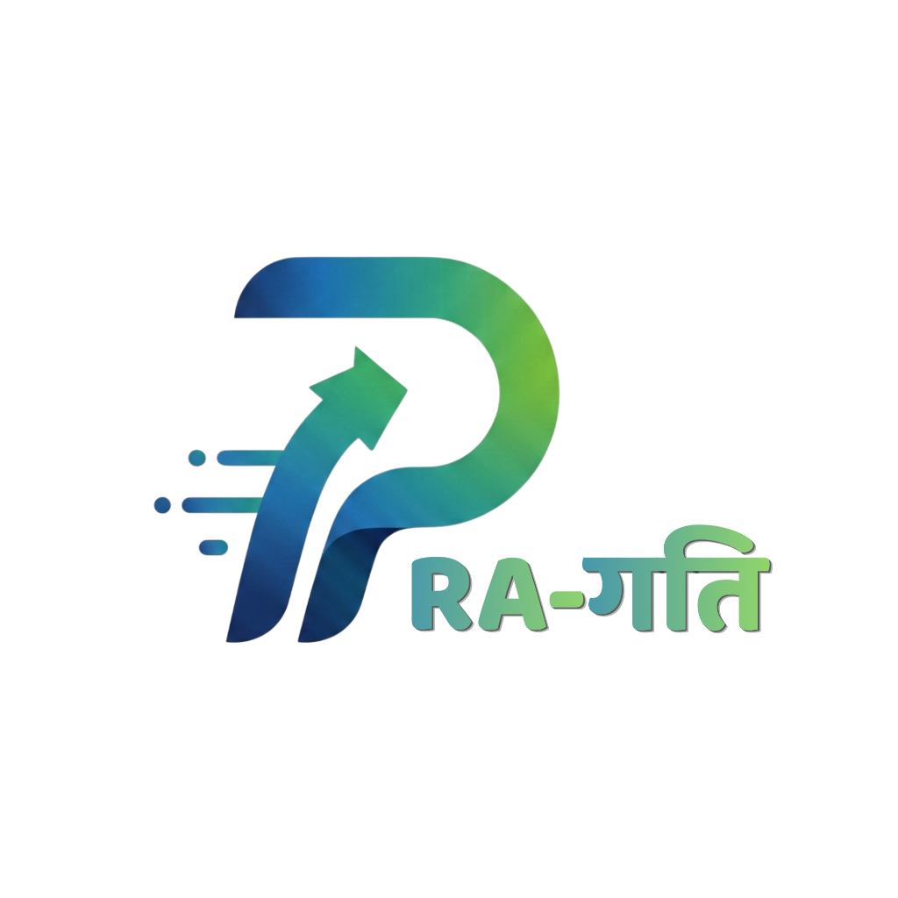

# TYRANTS
PWS : PRAGATI WORKFLOW SYSTEM

The aim of the Pragati Workflow System is to eliminate the friction between the client and the creative agencies.
This system acts as the bridge between your "finished work" and the client's "official yes."

WHY DO WE NEED A CLIENT APPROVAL WORKFLOW SYSTEM?
1. Navigating Multi-Layered Client Committees :
   Through the use of a centralized workflow system, large enterprises which usually have more than one decision makers can come to a single non contradictory opinion about the product, without overcomplicating things and having multiple opinions.

2. Legal Liability & Compliance Protection :
   With a reliable workflow system in place, products that have been completed and approved by the client cannot be further changed due to legal complications and agreements.

3. Preventing High-Cost Pipeline Bottlenecks :
   Workflow management system gives a wide overview of the entire project, including work responsibilities of employees, time allocation for each part of the project, completion rate, etc. which makes it easier for managers to prevent idle hours and extra expenses. 

4. Protection Against Client-Side Executive Turnover:
   In case the executive in charge of the project is changed or replaced, the workflow system provides the undeniable proof of all previous approval, brief, and sign-off, which prevents unpaid rework and complete redo of previously completed work.
